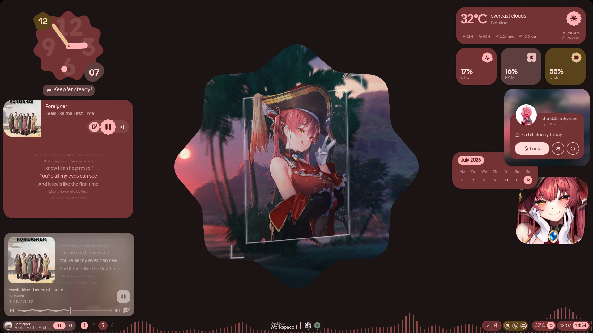
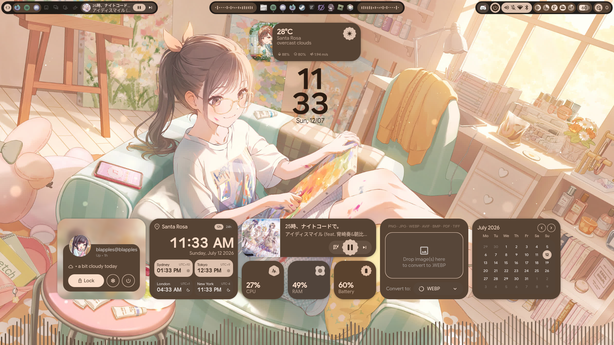
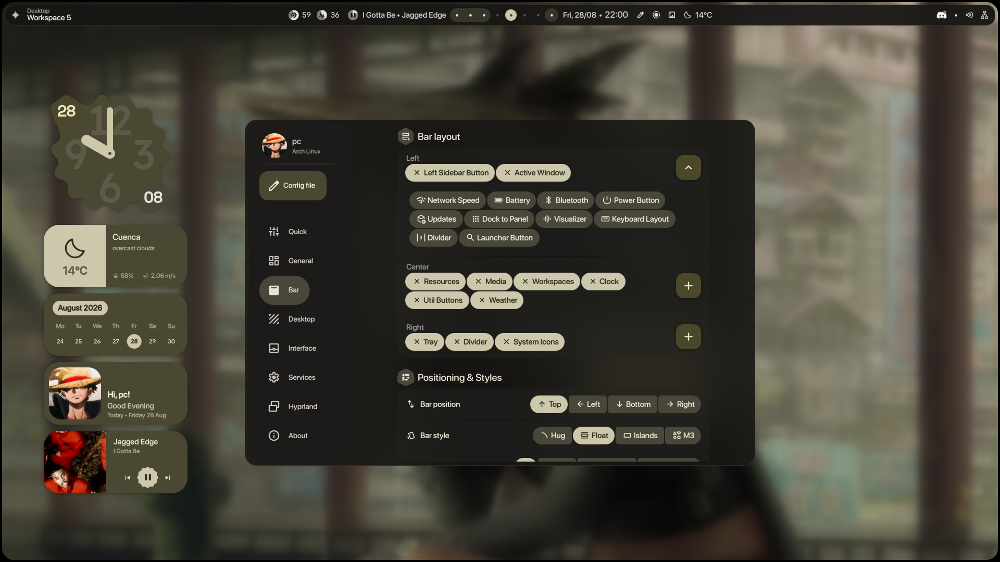
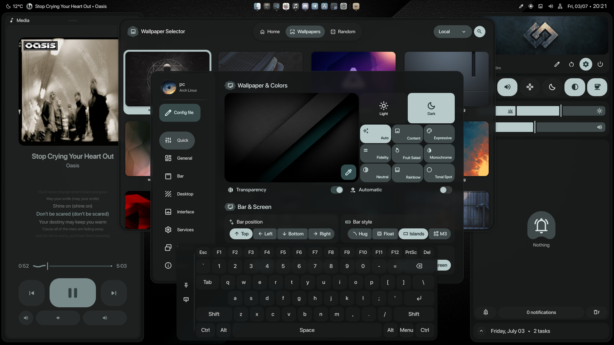

<div align="center">

# 💠 آفاق | Horizons

**A personal fork of [illogical-impulse](https://github.com/end-4/dots-hyprland) by [@end-4](https://github.com/end-4)**  
Customized and maintained by **pctrade**

[English](README.md) | [简体中文](README.zh-CN.md) | [日本語](README.ja.md)

</div>

---

## 🎬 Showcase

<p align="center">
  <a href="https://www.youtube.com/watch?v=o0Vsh7eVchs">
    
  </a>
</p>

</div>

---

## 📸 Screenshots
<div align="center">

| 🎵 Lyrics | 🖼️ Online Wallpapers |
|:---:|:---:|
|  |  |
| 🪟 Desktop Widgets | 🔧 Hyprland Configs |
|  |  |
| ⚙️ Configurable Bar | ✨ And More |
|  |  |

</div>

---

## ⚡ Installation

> [!NOTE]
> Horizons manages its own configuration folder (`~/.config/quickshell/horizons`) independently — it does **not** overwrite or modify any existing setup. It is a fork of, and requires, [illogical-impulse](https://github.com/end-4/dots-hyprland) (bundled here as `dotfiles/`) to be installed and running.

Use the single installer at the repo root — it installs the dotfiles base and this Quickshell config in one pass:

```bash
git clone https://github.com/PROFFESSOR0x/Horizons-DE.git Horizons-DE
cd Horizons-DE
./installer.sh
```

See [../installer.sh](../installer.sh) for flags (`--skip-deps`, `--skip-dots`, `--skip-qs`, `--uninstall`, etc.).

### 🔧 Set as your default shell (optional)

The installer does this for you. To do it manually, edit:

```bash
~/.config/hypr/hyprland/variables.lua
```

And change this line:

```lua
hl.env("qsConfig", "ii")
```

to:

```lua
hl.env("qsConfig", "horizons")
```

> [!TIP]
> If you're migrating from an older `end4-pC` / `illogical-impulse` install, existing config under `~/.config/illogical-impulse` and `~/.config/quickshell/end4-pC` is copied automatically to the new `horizons` paths on first run of `installer.sh`.

> [!TIP]
> After saving, restart Hyprland or run `hyprctl reload` to apply the change.

---

### ⚙️ Settings keybind

To open the settings panel, add this to your Hyprland config:

```lua
hl.bind("SUPER + escape", hl.dsp.global("quickshell:settingsToggle"), {description = "Toggle settings"})
```

> **Note:** Settings is an overlay panel, not a regular window — `Super + Q` won't close it. Use the same keybind to toggle it or press `Escape`.

---

## ❓ FAQ

### How do I see my keybinds?

Open the launcher (`SUPER`) and type `<` — it'll show you the full list of configured keybinds.

### Why doesn't Settings have a search bar?

It doesn't need one — the launcher already does that job. Open the launcher (`SUPER`) and just type what you're looking for (e.g. `wallpaper`, `bar`, `blur`); it'll match against page names and section keywords and jump you straight to the right Settings page, so there's no need for a separate search inside Settings itself.

---

## 🙏 Credits

Huge thanks to the people who made this possible:

- **[@end-4](https://github.com/end-4)** — for creating the original [dots-hyprland](https://github.com/end-4/dots-hyprland) / illogical-impulse shell. An absolute masterpiece of a dotfiles project 🫡
- **[@gh0stzk](https://github.com/gh0stzk)** — for providing the weather API integration that made the weather widget possible 🙌
- **[@StarS2112](https://github.com/StarS2112)** — for showcasing this fork 🙌
- **[@simeulinuxkaliaiwr](https://github.com/simeulinuxkaliaiwr)** — for some shader transitions 🎨

---

<div align="center">

Made with ❤️ — feel free to fork and make it your own

</div>
